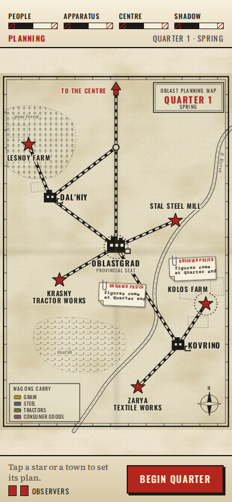
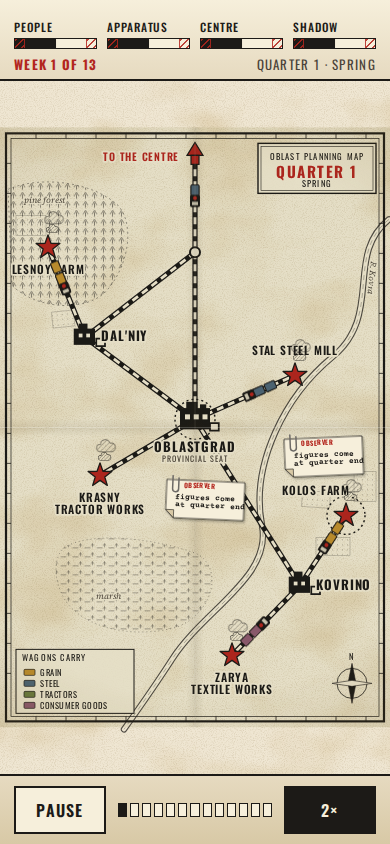
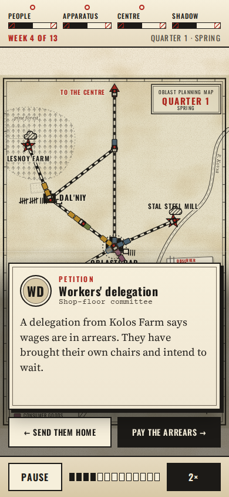
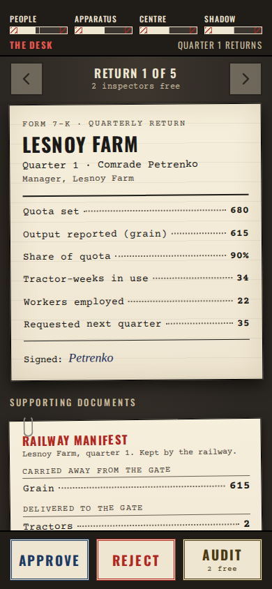
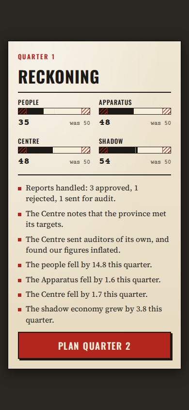
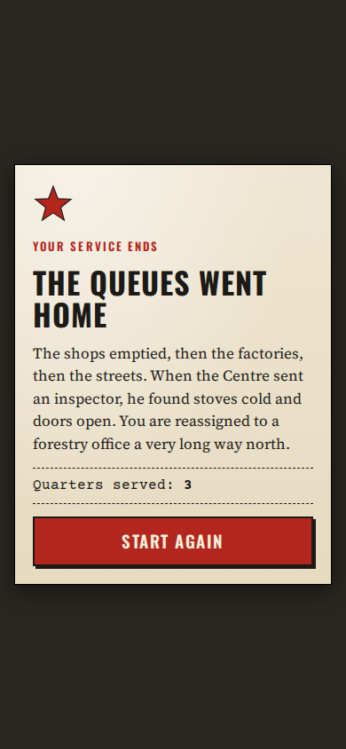

# Comrade Planner

A mobile-first web game: you are the planner of a small Soviet-style province, and everyone lies to you.
You set quotas, wages and prices, watch trains carry grain and steel across the map, then sit at the desk
and decide which of your managers' reports to believe. Four bars (People, Apparatus, Centre, Shadow) decide
how long you last.

Status: milestone 1 is complete: **phase A (simulation core)** and **phase B (game UI)** are both built.
The full spec is in `docs/work/milestone-1.md`.



## How to play

You are the Planner of a small province. Each quarter has four steps, and the four bars along the top
(People, Apparatus, Centre, Shadow) decide how long you last. **Both ends of every bar are fatal**; the
red hatching marks the edges.

1. **Plan (map, paused).** Tap a red star (an enterprise) or an ink block (a town) to open its bottom sheet:
   quota and wage for enterprises, state shop prices for towns, and how grain and steel are shared out.
   Post up to two **observers** from the same sheets; they write down the true figures at that place for
   the quarter. Press **Begin quarter**.
2. **Live quarter (about 75 seconds, 13 weeks).** Wagons run along the rail: solid when loaded, hollow when
   empty, coloured by cargo. Hatched smoke over a star means it produced this week. Tally marks by a town
   are its queue. Dotted pencil lines on the back roads to Kovrino are the night trucks. Footprints
   leading off the map edge mean people are leaving. **Pause** and **2x** are at the bottom.
   A **card** interrupts now and then: swipe it left or right (or tap a button, or use the arrow keys). Dots
   above a bar tell you which bars each choice would move, not by how much. A tip you act on drops a pin
   on the map.
3. **Desk (paused).** Every manager files a typewritten return. Beside it are the documents you have:
   the **railway manifest** (what actually moved by rail in and out of that enterprise, which is public
   and honest), an **observer's slip** if you posted one there, the **earlier return**, and an
   **audit finding** if one has come back. Compare what the manager reports with what the railway
   carried, then stamp **Approve**, **Reject** or **Audit** (audits need a free inspector and answer next
   quarter). Last, file **your own return** to the Centre with an inflate slider from honest to +50%.
   Padded figures please the Centre now, raise next year's targets, and are sometimes checked.
4. **Reckoning.** The bars slide to their new values with a short list of what you could know.
   Then plan the next quarter. When a bar hits either edge the **epitaph** appears, with **Start again**.

Screenshots (390x844): [live quarter](docs/screenshots/live-quarter.png),
[live quarter 2, with an observer's typed figures](docs/screenshots/live-quarter-q2.png),
[card](docs/screenshots/card.png), [plan sheet](docs/screenshots/sheet-plan.png),
[desk](docs/screenshots/desk.png), [desk documents](docs/screenshots/desk-documents.png),
[own return](docs/screenshots/own-report.png), [reckoning](docs/screenshots/reckoning.png),
[epitaph](docs/screenshots/epitaph.png).

| Live quarter                               | Card                               | Desk                               |
| ------------------------------------------ | ---------------------------------- | ---------------------------------- |
|  |  |  |

| Reckoning                                    | Epitaph                                  |
| -------------------------------------------- | ---------------------------------------- |
|  |  |

## Run it

```sh
npm install
npm run dev        # Vite dev server; open it on a phone-sized viewport (390x844 is the design size)
npm test           # Vitest; the 20-quarter headless run logs the bars per quarter
npm run lint       # ESLint (flat config); also enforces the sim/ui boundary
npm run typecheck  # tsc --noEmit, strict
npm run build      # typecheck + production build
npm run playtest   # plays 2 full quarters and an ending in real Chromium (Playwright); see below
```

Two URL parameters help with testing: `?seed=1234` fixes the game seed, and `?tickms=300` shortens a
week (default 5769 ms) for automated play. Fonts (Oswald, Courier Prime, Source Serif 4) load from
Google Fonts, with system fallbacks if offline.

### Play-test

`scripts/playtest.mjs` starts the Vite dev server (or uses `PLAYTEST_URL`), then drives the game in
Chromium at 390x844: sets sliders with the keyboard, posts observers, plays every quarter at 2x, answers
cards by swipe and by button, uses all three stamps, files an inflated return and continues. It also
measures that a week lasts about 5.8 s at 1x, then runs a fast game with the worst possible policy to
reach the epitaph and press Start again. Any console or page error fails the run. Screenshots land in
`docs/screenshots/`. Set `QUARTERS=3` to play more.

## Folder layout

```
src/sim/       pure, deterministic simulation. No React, DOM, Math.random or src/ui imports.
  facade.ts      the API the UI calls: newGame, setPlan, tick, chooseCard, decideReport, ...
  selectors.ts   what the player may see: visibleMap, pendingReports, bars, pins, observerFindings, manifests (rail records), ...
  balance.ts     every tunable coefficient, named and commented
  quarter.ts     turn loop: begin quarter, weekly step, quarter end, ratchet, bars
  world.ts       one week of the economy (wages, production, shipping, shopping, decay)
  rng.ts ledger.ts households.ts production.ts shipments.ts graph.ts managers.ts reports.ts
  observers.ts bars.ts cards.ts effects.ts tips.ts plan.ts init.ts stats.ts types.ts
src/content/   static data: map layout, enterprises, towns, characters, the card deck
src/ui/        React UI: one store (shell/store.ts) that calls the sim facade, screens by folder
  shell/         app column, header and bars, title, reckoning, epitaph, store, limits
  map/           SVG map: terrain and paper, rails, places, live layer (trains, trucks, queues,
                 smoke, footprints), pins and observer slips, the frame clock and quarter runner
  plan/          bottom sheets and slider fields for the plan phase
  cards/         the swipeable card
  desk/          typewritten returns, supporting documents, stamps, own return
  styles/        plain CSS, one file per area
scripts/       playtest.mjs (Playwright)
docs/work/     plans and specs
```

## How the sim is used

State is plain JSON-safe data with a seeded RNG inside it, so the same seed and inputs give an identical run.
Every facade call clones its input and returns a new state; calls made in the wrong phase return the state
unchanged.

```ts
let s = newGame(1234);
s = setPlan(s, defaultPlan()); // commits the plan and begins the quarter
while (s.phase === 'quarter') {
  const card = activeCard(s);
  s = card ? chooseCard(s, card.cardId, 'left') : tick(s);
}
for (const r of pendingReports(s)) s = decideReport(s, r.id, 'approve'); // r.documents.manifest: rail records
s = fileOwnReport(s, 1.0);
s = endQuarter(s); // reckoning(s) describes what happened
```

Money moves only through the ledger (`src/sim/ledger.ts`) and total money is conserved every tick
(`assertConserved`, checked every tick in dev and test builds).
